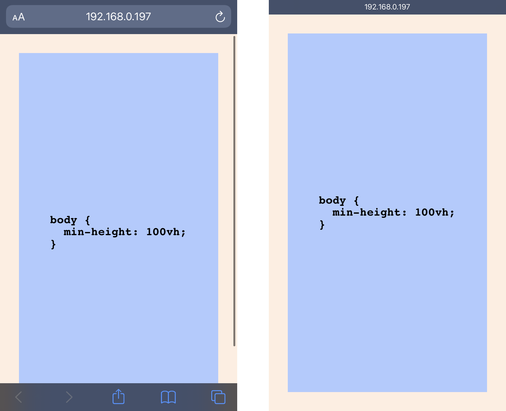
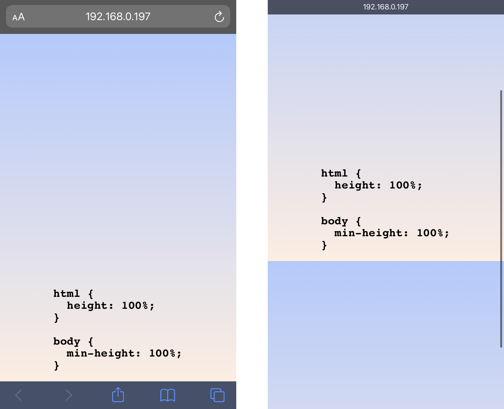

# Stretching body to full viewport height: the missing way

Suppose you're making a sticky footer or centering some content relative to the viewport. You want to stretch the `body` element to the full height of the browser window while also letting it grow even further to match its content. This task was surely solved a bazillion times, and it should be as easy as pie. Right? _Right?_

## The state-of-the-art way

Sure! Applying `min-height: 100vh` to the `body` element should do the trick. Here, `100vh` means that the initial `body` height will take 100% of the viewport height, whereas the use of `min-height` instead of `height` will let the `body` element grow even more if necessary. Isn't it exactly what we need?

Well... Almost. If we open such a page in a typical mobile browser (such as [iOS Safari](https://bugs.webkit.org/show_bug.cgi?id=141832#c5) or [Android Chrome](https://developers.google.com/web/updates/2016/12/url-bar-resizing)), it will be scrollable regardless of the size of its content. Even if the page has no content at all, its bottom will still disappear beneath the bottom UI panel of the browser!

The reason for this is fairly simple. UI elements in these browsers shrink after the scroll, providing additional space for the actual content. A height of `100vh` corresponds to the _maximum_ possible viewport height. Since the initial viewport height is smaller, the `body` element with a `min-height` of `100vh` initially exceeds the viewport height regardless of its content.



The known [fix](https://css-tricks.com/css-fix-for-100vh-in-mobile-webkit/) for this issue looks like this:

```css
html {
    height: -webkit-fill-available; /* We have to fix html height */
}

body {
    min-height: 100vh;
    min-height: -webkit-fill-available;
}
```

This solution has a minor glitch in Chrome: when the browser height increases, the `body` height stays the same, getting out of sync with the viewport height. Aside from that, this approach solves the issue.

However, we now have to fix the `html` height. If that's the case, shouldn't we use an older, more robust solution?

## The old-school way

Since we couldn't avoid fixing the `html` height, let's try the good old way that involves passing a height of 100% from the `html` element.

Let's apply `min-height: 100%` to the `body` element, where 100% is the full height of its parent (namely, `html`). A percentage height on a child requires its parent to have a fixed height, so we have to apply `height: 100%` to the `html` element, thereby fixing its height to the full viewport height.

Since the percentage height of the `html` element in mobile browsers is calculated relative to the _minimal_ viewport height, the above-mentioned scroll issue doesn't bug us anymore!

```css
html {
    height: 100%; /* We still have to fix html height */
}

body {
    min-height: 100%;
}
```

This solution is not as pretty as the `100vh` one, but it's been used since time immemorial, and it will work, that's for sure!

Well... Not quite. Apparently, the gradient applied to such a `body` element will be cut at the `html` height (in other words, at the viewport height, or, to be more precise, at the _minimal_ viewport height).

It happens because of the fixed `html` height, and it doesn't matter whether it's `height: 100%` or `height: -webkit-fill-available`.



Of course, this can be "fixed" by applying the gradient to the `body` content, but that's just not _right_. The page background _should_ be applied to the `body` element, and the `html` element _should_ stretch to its content. Can we achieve that?

## The missing way

I dare to suggest another way of stretching the `body` element to the full viewport height without the above-mentioned issues. The core idea is to use flexbox, which allows a child element to stretch to its parent dimensions even if these dimensions aren't fixed, without losing the ability to grow further.

We apply `min-height: 100%` to the `html` element, stretching it to the full _minimal_ viewport height and letting it grow even further as necessary. We then apply `display: flex` and `flex-direction: column` to it, making it a flex-container with vertical main axis. Finally, we apply `flex-grow: 1` to the `body` element, stretching it to the `html` height and letting it grow with its content as well.

The `align-self` property of the `body` element implicitly has the `stretch` value, so the `body` width already matches the `html` width.

```css
html {
    min-height: 100%; /* Look, it's not fixed anymore! */

    display: flex;
    flex-direction: column;
}

body {
    flex-grow: 1;
}
```

Now both `html` and `body` elements can stretch to their content, and, since we're using the percentage height, there are no issues with mobile browsers whatsoever. Neat!

## Notes

-   It should be obvious that the flexbox-based solution works for any depth. It can easily be used in cases where the content is being rendered to an element inside the `body`, and not the `body` element itself. It's a typical scenario with [React](https://medium.com/@dan_abramov/two-weird-tricks-that-fix-react-7cf9bbdef375) or [Vue](https://vuejs.org/v2/api/#el), for example.

-   As you might've noticed, the direction of the main axis of the flex-container shouldn't matter. I just think that the vertical axis is more aesthetic in this case, and I didn't really test the other variant. I don't see how it can possibly break, but who knows.

-   The flexbox-based solution doesn't work in IE. Not at all. But you don't support it anyway, do you?
